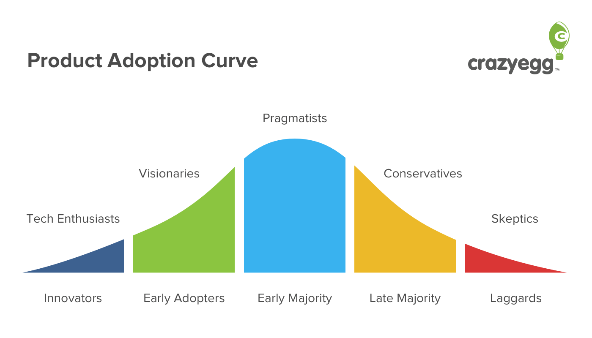
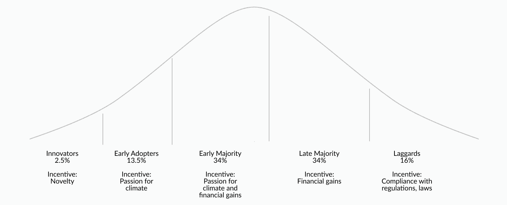

In marketing and product development, there is a common framework known as the "Product Adoption Curve". This model represents a typical, if generalized breakdown of who buys products, when, and why. This model can be extremely useful for understanding what kinds of customers to go after, when, and how best to convince them to buy your product. Below is an example of the typical Product Adoption Curve, courtesy of [crazyegg](https://www.crazyegg.com/blog/product-adoption-to-transform-marketing/).

*Source : [https://www.crazyegg.com/blog/product-adoption-to-transform-marketing/](https://www.crazyegg.com/blog/product-adoption-to-transform-marketing/)*

While climate change solutions, interventions, and initiatives, are not always "products' per se, they also have an "adoption curve" of sorts; for a given solution, it can be helpful to think about which cohorts are likely to adopt the solution, when, and why (what their incentives are).

Consider the example of rooftop solar panels. 5-10 years ago, when the economics for solar weren't as advantageous for consumers, you could consider the solution further to the left on the "adoption curve", where the likely adopters were a small group of "enthusiasts". Their incentives for adoption might be intrinsic belief in helping fight climate change, interest in off-grid living, etc.

Several years later, rooftop solar might move further to the right of the curve, as more folks are willing to adopt it because the economics are more advantageous. These folks, who are more pragmatic, might be most motivated with financial incentives. It's key to note here that this solution doesn't inevitably move through this adoption curve - it requires a great deal of work to develop new value that will fit with the incentives of larger, but less intrinsically motivated, cohorts.

Finally, let's look 10 years in the future, where a fictional government mandates by law that all new and existing residential construction must have rooftop solar. In this case, the conservative and skeptic cohorts in the adoption curve will be very likely to adopt the solution, as they will respond to one of the ultimate incentives - legal incentives.

Below is an example of a "climate adoption curve" - the breakdown of cohorts, timing, motivations, etc. is not generalizable; different solutions will be have different looking curves. But when considering how to popularize a climate solution, using such a curve may be helpful in answering questions like:

- Who is most likely to use my solution now? What will motivate them to do so?
- What would motivate new cohorts/personas to adopt my solution? What is the corresponding market size or opportunity?
- What are the best ways to engage the cohorts that are most likely to adopt my solution?

    
