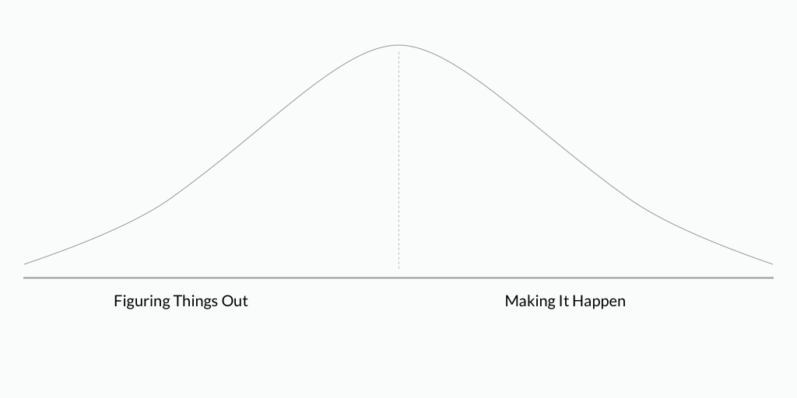
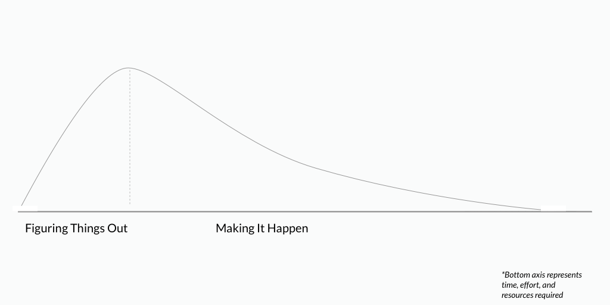

To mitigate and adapt to climate change, we need a broad range of solutions, some requiring large amounts of R&D, funding, etc, and others not so much. Regardless, every solution must not only be conceived, but also implemented.

With any given solution, whether it's building sea walls to prevent flooding in cities or developing more efficient solar panels, requires people and organizations to first develop theories, technology, prototypes and pilot projects to demonstrate the efficacy and relevance of the solution. Broadly speaking, these folks can be said to be **Figuring Things Out.**

Once a solution is found to be effective, then it must be scaled up and implemented. This is the logical next step in almost every field, but climate change presents the unique challenge and need of scaling solutions very quickly across the globe, working within a variety of local cultural and regulatory contexts. This requires folks on the ground, educating the population, knocking on doors, etc. These people are, for example, our solar panel installers, building retrofitters, grassroots organizers, conversation volunteers, early childhood educators. Once again broadly generalizing, these people are **Making It Happen.**

Where a given solution sits in this cycle of developing solutions to implementing them can be modeled by a concept developed by software company Basecamp called [the Hill Chart](https://basecamp.com/features/hill-charts), which is recreated below:

In some cases for climate change solutions, it's easy for the same actors both figure things out and make it happen. If you're developing a curriculum to better engage children with nature and local food systems, you're probably in a good position to teach it as well. Other times, it's not so easy. The same skills that allowed one to develop the material that increases a solar panel's capacity factor by 5% aren't easily applicable to the challenge of convincing homeowners to put the solar panels on their roof, or convince policymakers to subsidize the installation of the solar panels.

In addition, in many cases it can require far more people and resources to make it happen than to figure it out, especially when the solution should be implemented at the massive scale that climate change often demands. If we recreate the above graph, but use the X axis to represent time, resources, and effort required, many climate change solutions may actually look like this:

In the real world, the lines are much fuzzier between actors and processes that figure things out versus making things happen, but trying to use these classifications can perhaps add some objectivity and structure to evaluating and developing solutions.

Society tends to romanticize the process of figuring things out, while underestimating and overlooking the process of making it happen.

So when evaluating climate change mitigation and adaptation solutions, consider the following questions:

- What stage is this solution at? Should we be more focused on figuring things out or making them happen?
- Where are/could be the biggest bottlenecks in developing and scaling this solution? In many cases the biggest bottlenecks might be around making it happen (ex. building a robust ecosystem of solar project developers/installers).
- For a given solution, am I or is my organization best suited to figure it out, or to make it happen? Who are the various other players and what role are they best suited to play?

